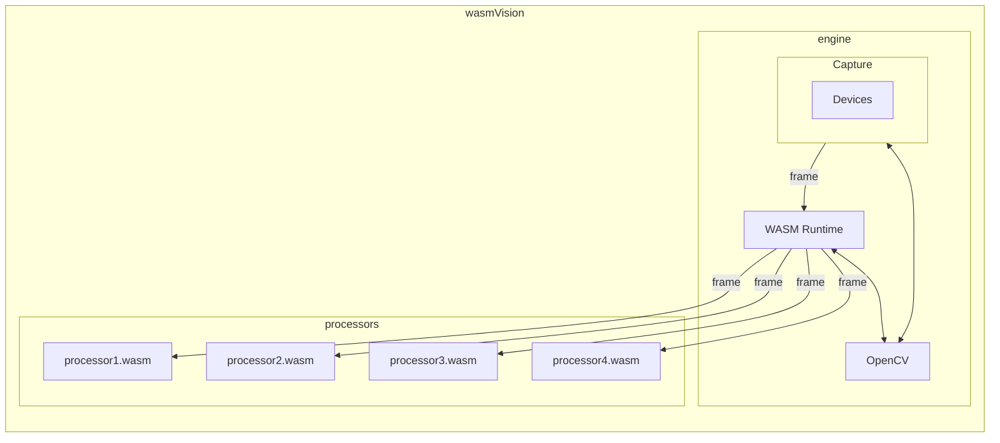

# Architecture

## Overview

The pipeline of Processor modules are called in order, one after another. The output from the first is passed into the second, and so on. Once the last processor module has finished, the frame resources are cleaned up. Then the next frame is read from the capture device and passed into the first processor module.

### Engine

The wasmVision engine. Includes some platform capabilities such as MJPEG streaming and saving to files.

### Capture

This is how wasmVision can capture or import images or video to be processed.

### Devices

Specific hardware or software devices that capture images or video. Currently supported devices are a connected camera or a file input.

### Runtime

The wasmVision runtime consists of the WebAssembly runtime engine (currently Wazero) and the wasmVision host platform API functions such as logging and configuration.

### Processors

The wasmCV image processing modules that are used by wasmVision. See [processors directory](./processors/).

### OpenCV

The computer vision processing capabilities implemented using OpenCV/GoCV. Take a look at the [`cv` directory](./cv/) for the code for this integration.
