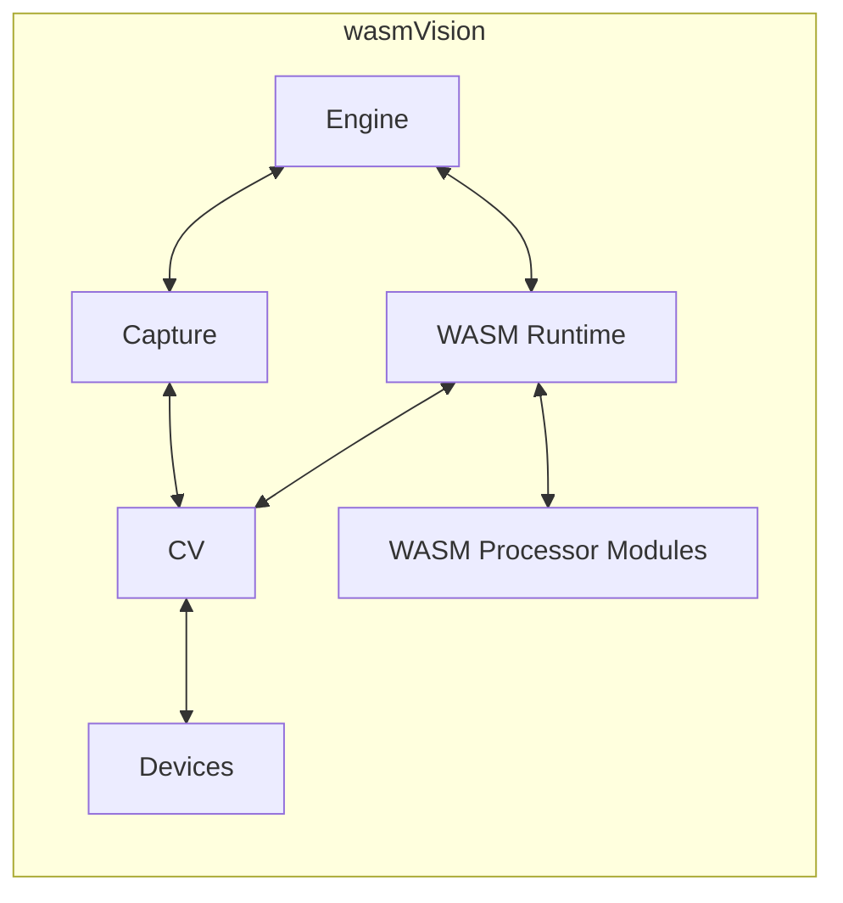

# Architecture

## Overview

### Engine

The host application.

### Capture

This is how wasmVision can capture or import images or video to be processed,

### Devices

Specific hardware or software devices that capture images or video,

### Runtime

The WebAssembly runtime engine, currently Wazero.

### Modules

The wasmCV image processing modules that developers are writing.

### CV

The computer vision processing capabilities implemented using OpenCV/GoCV.

