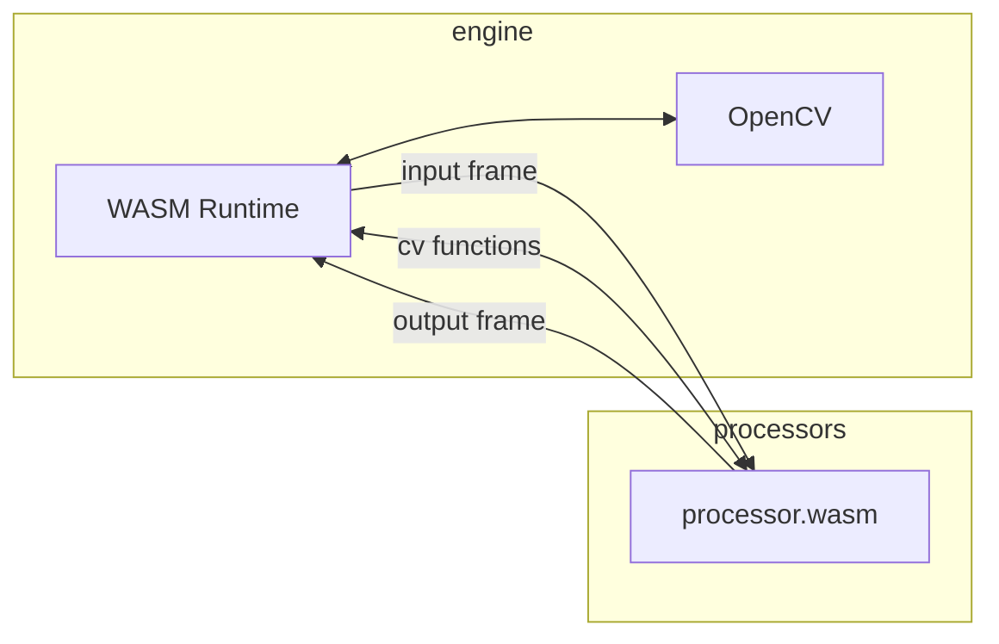

# Processors

wasmVision processing modules are WebAssembly guest modules that support the [wasmCV interface](https://wasmcv.org).

Processors can filter images, analyze them, and modify them using traditional computer vision algorithms.

Processors can also use deep neural networks and other machine learning algorithms, and can even download the models they need automatically.

See the [processors directory](./processors/) for pre-compiled processors you can try out right away.

Processors can be written in Go, Rust, or the C programming language.

## How processors work

wasmVision processors call OpenCV functions implemented by the wasmVision engine to obtain information or perform operations on image frames.

Full documentation of the computer vision functions supported by the wasmCV interface definitions is here: 
https://wasmcv.org/docs/0.4.0/

The repository with the wasmCV interface and bindings can be found here:
https://github.com/wasmvision/wasmcv
