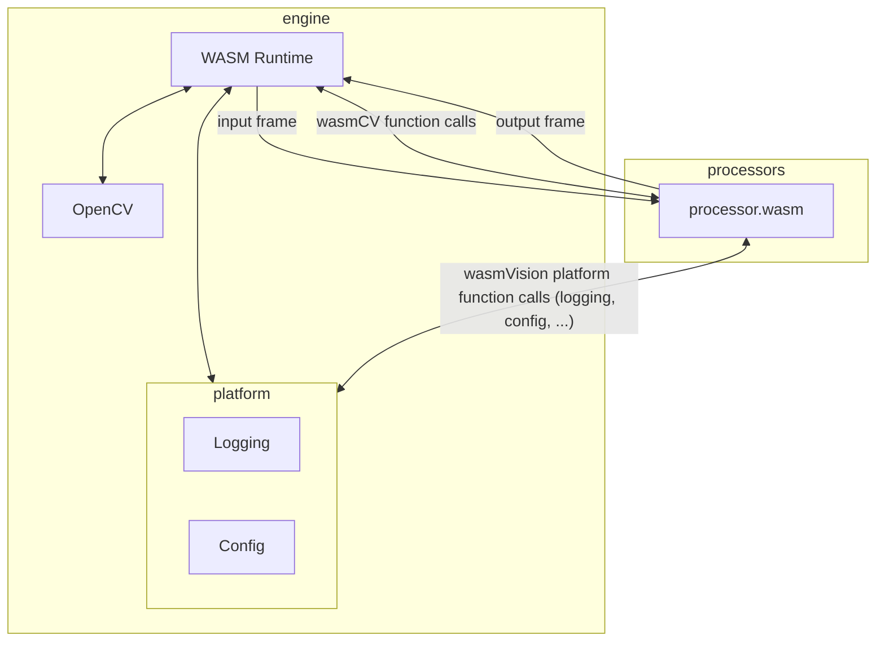

# Processors

wasmVision processing modules are WebAssembly guest modules that support the [wasmCV interface](https://wasmcv.org).

Processors can filter images, analyze them, and modify them using traditional computer vision algorithms.

Processors can also use deep neural networks and other machine learning algorithms, and can even download the models they need automatically.

See the [processors directory](./processors/) for pre-compiled processors you can try out right away.

Processors can be written in [Go](#go), [Rust](#rust), or the [C programming language](#c).

## How processors work

### wasmCV

wasmVision processors call OpenCV functions implemented by the wasmVision engine to obtain information or perform operations on image frames. To do this, processors use the wasmCV bindings for the programming language being use to create the processor.

Full documentation of the computer vision functions supported by the wasmCV interface definitions is here:

https://wasmcv.org/docs/0.6.0/

The repository with the wasmCV interface and bindings can be found here:

https://github.com/wasmvision/wasmcv

### wasmVision Platform

In addition, the wasmVision engine has functions that are part of the platform itself. For example, processors need logging, the ability to load configuration data at runtime, and other capabilities. The repository with the wasmVision platform interfaces is here:

https://github.com/wasmvision/wasmvision-sdk

## Developing new processors

### Go

Many of the processors in this repo have been written using TinyGo as an example of some of the things you can do:

https://github.com/wasmvision/wasmvision/tree/main/processors

Developing a new processor using the Go programming language requires using TinyGo to compile the module to WebAssembly using either the `wasm-unknown` or `wasip1` target.

The package with the Go bindings for wasmCV is located here:

https://github.com/wasmvision/go-wasmcv

The package with the Go bindings for the wasmVision platform SDK is located here:

https://github.com/wasmvision/wasmvision-sdk-go

### Rust

The `blurrs.wasm` and `facedetectynrs.wasm` processors in this repo have been written using Rust as an example of some of the things you can do:

https://github.com/wasmvision/wasmvision/tree/main/processors/blurrs

https://github.com/wasmvision/wasmvision/tree/main/processors/facedetectynrs

Developing a new processor using the Rust programming language requires compiling the module to WebAssembly using the `wasm32-unknown-unknown` target.

The crate with the Rust bindings for wasmCV is located here:

https://crates.io/crates/wasmcv

The crate with the Rust bindings for the wasmVision platform SDK is located here:

https://crates.io/crates/wasmvision

### C

The `blurc.wasm` processor in this repo has been written using C as an example of some of the things you can do:

https://github.com/wasmvision/wasmvision/tree/main/processors/blurc

Developing a new processor using the C programming language requires using `clang` to compile the module to WebAssembly using the `wasm32-unknown-unknown` target.

The files for the C bindings for wasmCV are located here:

https://github.com/wasmvision/wasmcv/tree/main/components/c/wasmcv

The files for the C bindings for the wasmVision platform SDK are located here:

https://github.com/wasmvision/wasmvision-sdk/tree/main/components/c/wasmvision
