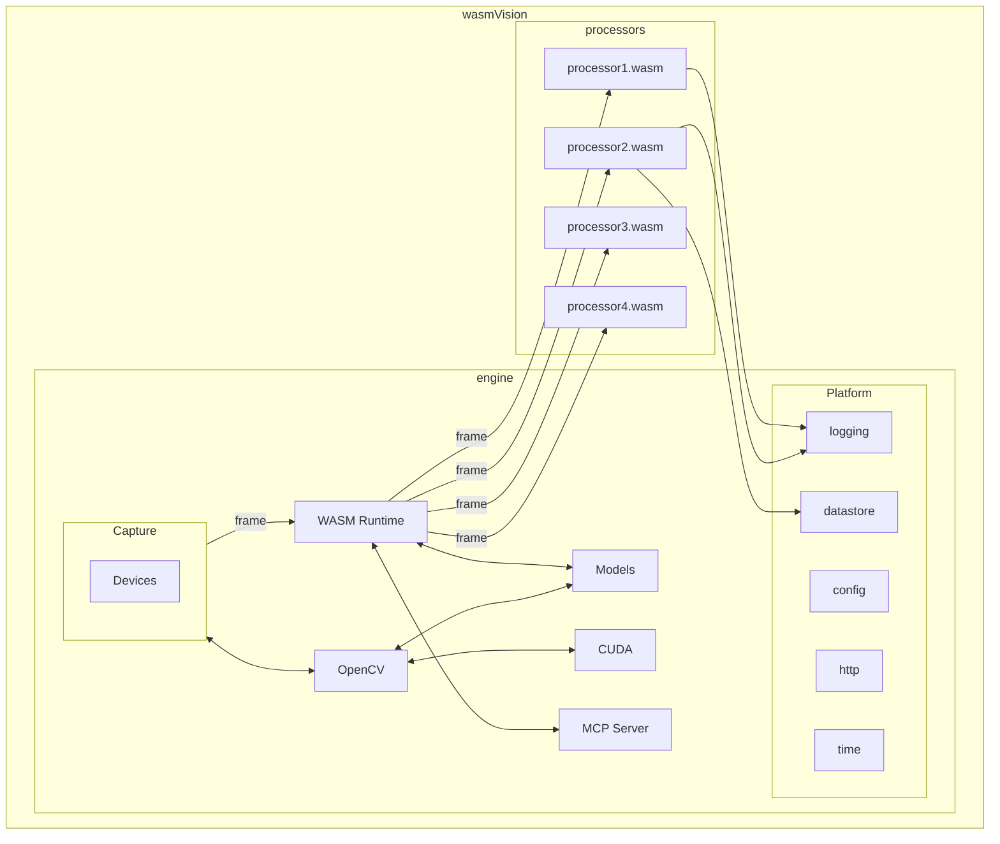

# Get going with computer vision

   

wasmVision is a high-performance computer vision processing engine with advanced algorithms and vision models, that is designed to be customized and extended using WebAssembly.

It can run on embedded devices or run in the cloud, and can take advantage of hardware acceleration.

## How it works

- [Capture video from cameras, video files, or streams](https://wasmvision.com/docs/concepts/capture/)
- [Process video using computer vision algorithms and machine learning models using WebAssembly](https://wasmvision.com/docs/concepts/process/)
- [Output results to a stream, video file, or data store](https://wasmvision.com/docs/concepts/output/)

### wasmVision Engine

The wasmVision engine is a standalone binary application for Linux, macOS, or Windows that contains everything you need with no other dependencies.

It is written in the [Go programming language](https://go.dev/) using the [GoCV Go language wrappers](https://github.com/hybridgroup/gocv) for [OpenCV](https://github.com/opencv/opencv) and the [Wazero WASM runtime](https://github.com/tetratelabs/wazero).

See the [ARCHITECTURE](https://wasmvision.com/docs/concepts/architecture) document for more details.

### wasmVision Processors

wasmVision processing modules are WebAssembly guest modules that support the [wasmCV interface](https://wasmcv.org).

Processors can filter images, analyze them, and modify them using traditional computer vision algorithms.

Processors can also use deep neural networks and machine learning models, and can even download the models they need automatically.

You can use the Go, Rust, and C programming language to write the code for processors.

Want some processors you can try out right away? Take a look at these:

- [`blur.wasm`](./processors/blur/) for image blurring using Go
- [`blurrs.wasm`](./processors/blurrs/) for image blurring using Rust
- [`blurc.wasm`](./processors/blurc/) for image blurring using C
- [`facedetectyn.wasm`](./processors/facedetectyn/) for face detection using a deep neural network using Go
- [`facedetectynrs.wasm`](./processors/facedetectynrs/) for face detection using a deep neural network using Rust
- [`ollama.wasm`](./processors/ollama/) live image descriptions using integration with [Ollama](https://ollama.com/) using Go
- [`style-transfer.wasm`](./processors/style-transfer/) for a cool effect using fast neural style transfer using Go

Check out the [Processors List](https://wasmvision.com/docs/reference/processors/) for the complete list.

Want more information about how processors work and how to develop your own? See [Concepts - Processors](https://wasmvision.com/docs/concepts/processors/). 

### MCP Server

wasmVision includes experimental support for the [Model Context Protocol (MCP)](https://modelcontextprotocol.info/) by providing a [(MCP) Server](https://modelcontextprotocol.info/specification/draft/server/). See [MCP](https://wasmvision.com/docs/concepts/mcp/) for more information.

### GPU Acceleration using CUDA

wasmVision includes experimental support for GPU acceleration using [CUDA](https://en.wikipedia.org/wiki/CUDA).

For more information, see [wasmVision with CUDA](https://wasmvision.com/docs/concepts/cuda/)

## Quick start

- [Linux](https://wasmvision.com/getting-started/install/linux/)
- [macOS](https://wasmvision.com/getting-started/install/macos/)
- [Windows](https://wasmvision.com/getting-started/install/windows/)
- [Docker](https://wasmvision.com/getting-started/install/docker/)

## Development

For information on how to obtain development builds, or work on development for wasmVision itself, please see [DEVELOPMENT](https://wasmvision.com/docs/guides/development/)
