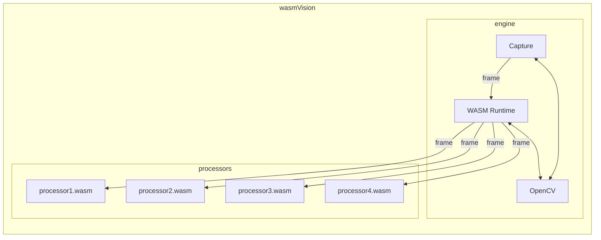

[](https://github.com/wasmvision/wasmvision/actions/workflows/linux.yml) [](https://github.com/wasmvision/wasmvision/actions/workflows/macos.yml) [](https://github.com/wasmvision/wasmvision/actions/workflows/windows.yml) [](https://github.com/wasmvision/wasmvision/actions/workflows/docker.yml)

wasmVision gets you up and running with computer vision.

It provides a high-performance computer vision processing engine that is designed to be customized and extended using WebAssembly.

## Quick start

### Docker

You can run wasmVision using Docker.

Pull the current development version:

```shell
docker pull ghcr.io/wasmvision/wasmvision:main
```

And run it:

```shell
docker run --privileged --network=host ghcr.io/wasmvision/wasmvision:main run -p /processors/blur.wasm -mjpeg=true
```

Now point your browser to `http://localhost:8080` and you can see the output.


### macOS

NOTE: this is not completed, but will be working once wasmVision 0.1.0 is released.

You can install wasmVision on macOS using Homebrew:

```shell
brew tap wasmvision/tools
brew install wasmvision
```

Verify it is installed like this:

```shell
wasmvision
```

### Linux

Instructions about how to download binaries will go here.

### Windows

Binaries coming soon!

### Development install

If you have a local installation of both Go and OpenCV you can install wasmVision directly:

```shell
git clone https://github.com/wasmvision/wasmvision.git
cd wasmvision
go install ./cmd/wasmvision/
```

And run it:

```shell
wasmvision run -p ./processors/hello.wasm -mjpeg=true
```

Now point your browser to `http://localhost:8080` and you can see the output.

## How it works



The wasmVision engine is written in the [Go programming language](https://go.dev/) using the [GoCV Go language wrappers](https://github.com/hybridgroup/gocv) for [OpenCV](https://github.com/opencv/opencv) and the [Wazero WASM runtime](https://github.com/tetratelabs/wazero).

wasmVision processing modules are WebAssembly guest modules that support the [wasmCV interface](https://github.com/wasmvision/wasmcv).

See the [processors directory](./processors/) for some already compiled processors you can try out.

These processing modules can be written in Go, Rust, or the C programming language.

The pipeline of Processor modules are called in order, one after another. The output from the first is passed into the second, and so on. Once the last processor module has finished, the frame resources are cleaned up. Then the next frame is read from the capture device and passed into the first processor module.

See the [ARCHITECTURE.md](ARCHITECTURE.md) document for more details.


