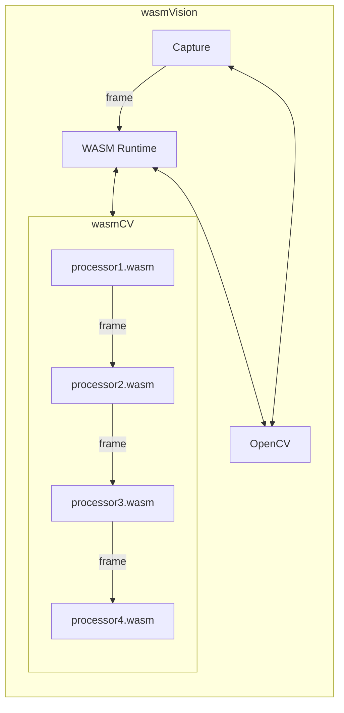

# wasmVision

wasmVision is a high-performance computer vision processing engine designed to be customized and extended using WebAssembly.

## How it works



The wasmVision engine is written in the [Go programming language](https://go.dev/) using the [GoCV Go language wrappers](https://github.com/hybridgroup/gocv) for [OpenCV](https://github.com/opencv/opencv) and the [Wazero WASM runtime](https://github.com/tetratelabs/wazero).

wasmVision processing modules are WebAssembly guest modules that support the wasmCV interface.

See https://github.com/hybridgroup/wasmcv

These processing modules can be written in Go, Rust, or the C programming language.

The pipeline of Processor modules are called in order, one after another. The output from the first is passed into the second, and so on. Once the last processor module has finished, the frame resources are cleaned up. The the next frame is read from the capture device and passed into the first processor module.

See the [ARCHITECTURE.md](ARCHITECTURE.md) document for more details.

## How to run it

```shell
go run ./cmd/wasmvision -processors=/path/to/your/processor1.wasm,/path/to/your/processor2.wasm
```
