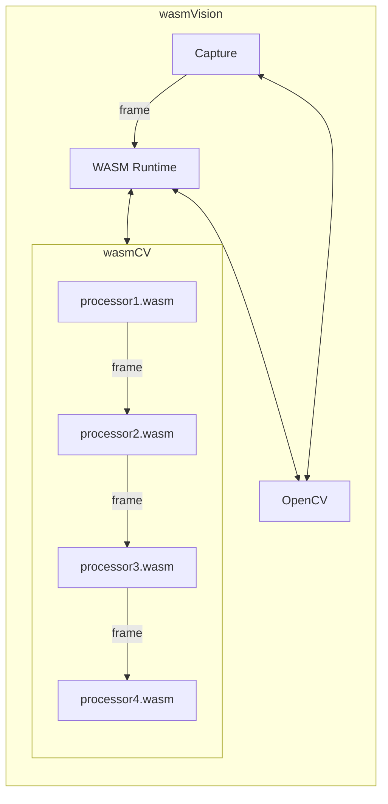

[](https://github.com/wasmvision/wasmvision/actions/workflows/test.yml) [](https://github.com/wasmvision/wasmvision/actions/workflows/docker.yml)

wasmVision gets you up and running with computer vision.

It provides a high-performance computer vision processing engine that is designed to be customized and extended using WebAssembly.

## How to run it

### Using Docker

You can run wasmVision using Docker.

Pull the current development version:

```shell
docker pull ghcr.io/wasmvision/wasmvision:main
```

And run it:

```shell
docker run --privileged --network=host ghcr.io/wasmvision/wasmvision:main run -p /examples/processors/blur.wasm -mjpeg=true
```

Now point your browser to `http://localhost:8080` and you can see the output.


### Using a local installation of OpenCV

If you have a local installation of OpenCV you can install wasmVision directly:

```shell
go install ./cmd/wasmvision/
```

```shell
wasmvision run -p ./examples/processors/hello.wasm
```

Want to see what wasmVision is doing in your browser? Use the `-mjpeg=true` flag.

```shell
wasmvision -p ./examples/processors/blur.wasm -mjpeg=true
```

## How it works



The wasmVision engine is written in the [Go programming language](https://go.dev/) using the [GoCV Go language wrappers](https://github.com/hybridgroup/gocv) for [OpenCV](https://github.com/opencv/opencv) and the [Wazero WASM runtime](https://github.com/tetratelabs/wazero).

wasmVision processing modules are WebAssembly guest modules that support the [wasmCV interface](https://github.com/wasmvision/wasmcv).

See [examples/processors](./examples/processors/) for some already compiled processors you can try out.

These processing modules can be written in Go, Rust, or the C programming language.

The pipeline of Processor modules are called in order, one after another. The output from the first is passed into the second, and so on. Once the last processor module has finished, the frame resources are cleaned up. The the next frame is read from the capture device and passed into the first processor module.

See the [ARCHITECTURE.md](ARCHITECTURE.md) document for more details.

