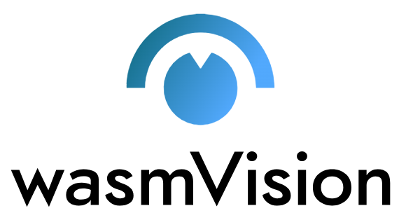
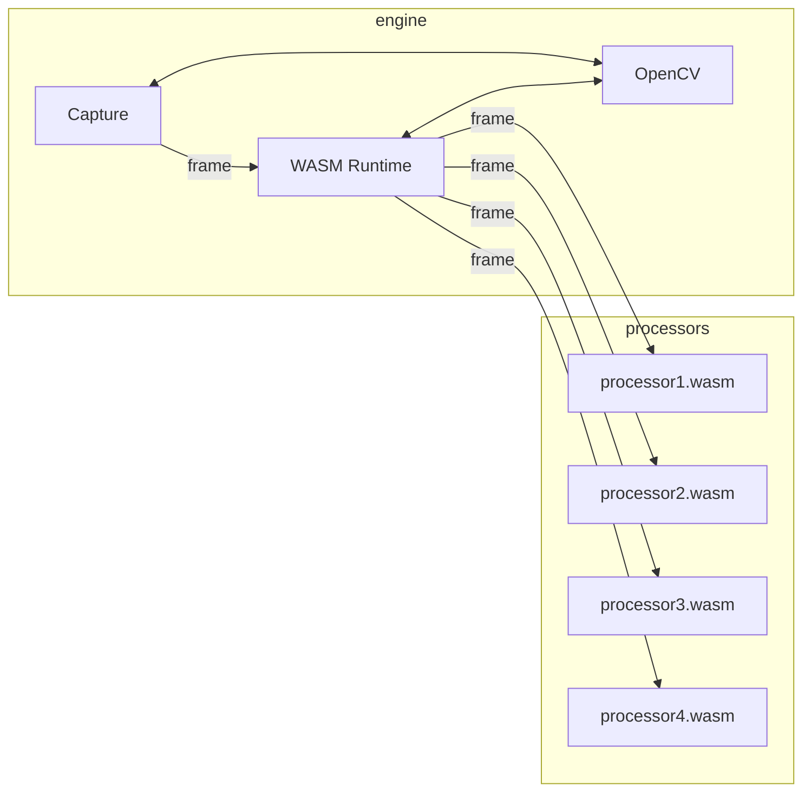
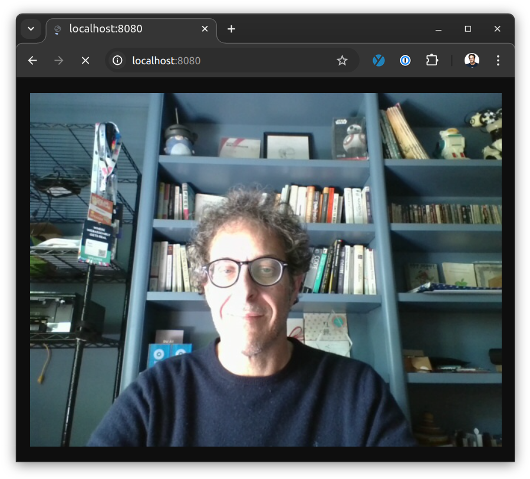

# Get going with computer vision

[](https://github.com/wasmvision/wasmvision/actions/workflows/linux.yml) [](https://github.com/wasmvision/wasmvision/actions/workflows/macos.yml) [](https://github.com/wasmvision/wasmvision/actions/workflows/windows.yml) [](https://github.com/wasmvision/wasmvision/actions/workflows/docker.yml)

wasmVision gets you going with computer vision.

It provides a high-performance computer vision processing engine that is designed to be customized and extended using WebAssembly.

## How it works

- [Capture video from a camera, video file, or stream](./docs/capture.md)
- [Process the video frames using WebAssembly](./docs/processor.md)
- [Output the results to a stream or video file](./docs/output.md)



### wasmVision Engine

The wasmVision engine is a standalone binary application for Linux, macOS, or Windows that contains everything you need with no other dependencies.

It is written in the [Go programming language](https://go.dev/) using the [GoCV Go language wrappers](https://github.com/hybridgroup/gocv) for [OpenCV](https://github.com/opencv/opencv) and the [Wazero WASM runtime](https://github.com/tetratelabs/wazero).

See the [ARCHITECTURE](./docs/architecture.md) document for more details.

### wasmVision Processors

wasmVision processing modules are WebAssembly guest modules that support the [wasmCV interface](https://wasmcv.org).

Processors can filter images, analyze them, and modify them using traditional computer vision algorithms.

Processors can also use deep neural networks and other machine learning algorithms, and can even download the models they need automatically.

You can use Go, Rust, or the C programming language to write the code for processors.

Want some processors you can try out right away? Take a look at these:

- [`blur.wasm`](./processors/blur/) for image blurring using Go
- [`blurrs.wasm`](./processors/blurrs/) for image blurring using Rust
- [`blurc.wasm`](./processors/blurc/) for image blurring using C
- [`facedetectyn.wasm`](./processors/facedetectyn/) for face detection using a deep neural network using Go
- [`facedetectynrs.wasm`](./processors/facedetectynrs/) for face detection using a deep neural network using Rust
- [`mosaic.wasm`](./processors/mosaic/) for a cool effect using fast neural style transfer using Go
- [`ollama.wasm`](./processors/ollama/) live image descriptions using integration with [Ollama](https://ollama.com/) using Go

Check out the [processors directory](./processors/) for the complete list.

See the [PROCESSOR](./docs/processor.md) document for more information about how processors work and how to develop your own.

### MCP Server

wasmVision includes experimental support for the [Model Context Protocol (MCP)](https://modelcontextprotocol.info/) by providing a [(MCP) Server](https://modelcontextprotocol.info/specification/draft/server/). See [MCP](./docs/mcp.md) for more information.

### GPU Acceleration using CUDA

wasmVision includes experimental support for GPU acceleration using [CUDA](https://en.wikipedia.org/wiki/CUDA).

For more information, see [using wasmVision with CUDA](./docs/cuda.md)

## Quick start

- [Linux](#linux)
- [macOS](#macos)
- [Windows](#windows)
- [Docker](#docker)

### Linux

Download the latest release for Linux under [Releases](https://github.com/wasmvision/wasmvision/releases) by clicking on the latest release.

Under "Assets" click on the link for either "wasmvision-linux-amd64" or "wasmvision-linux-arm64" depending on your processor.

Extract the executable to your desired directory.

You might need to set the file as "executable", which you can do from the command line by running `chmod +x ./wasmvision` in the same directory to which you extracted the `wasmvision` executable.

Verify wasmVision is installed by running these commands:

```shell
cd /path/to/wasmvision/install
wasmvision version
```

Now you can run a test to capture video using your webcam, blur it using a WebAssembly processor, and then stream the output to port 8080 on your local machine:

```shell
wasmvision run -p blur
```

wasmVision will automatically download the `blur.wasm` processor from our repo to your local `$HOME/processors` directory.

Point your browser to `http://localhost:8080` and you can see the output.



Want to know more? Please see [USING](./docs/using.md)

### macOS

**NOTE: wasmVision currently runs on M-series processors only when using the Homebrew installer. You must install from source to use Intel processors.**

Install wasmVision on macOS using Homebrew:

```shell
brew tap wasmvision/tools
brew install wasmvision
```

Verify it is installed like this:

```shell
wasmvision version
```

Now you can run a test to capture video using your webcam, blur it using a WebAssembly processor, and then stream the output to port 8080 on your local machine:

```shell
wasmvision run -p blur
```

wasmVision will automatically download the `blur.wasm` processor from our repo to your local `$HOME/processors` directory.

Point your browser to `http://localhost:8080` and you can see the output.

Want to know more? Please see [USING](./docs/using.md)

### Windows

Download the latest release for Windows under [Releases](https://github.com/wasmvision/wasmvision/releases) by clicking on the latest release.

Under the "Assets" click on the link for "wasmvision-windows-amd64".

NOTE: you will likely need to configure your Windows Defender to download the ZIP file with the `wasmvision.exe` executable.

Extract the executable to your desired directory.

Verify it is installed like this:

```shell
chdir C:\path\to\wasmvision\install
wasmvision.exe version
```

Now you can run a test to capture video using your webcam, blur it using a WebAssembly processor, and then stream the output to port 8080 on your local machine:

```shell
wasmvision.exe run -p blur
```

wasmVision will automatically download the `blur.wasm` processor from our repo to your local `$HOME/processors` directory.

You will probably need to configure Windows Firewall to allow the `wasmvision.exe` executable to access the network port on your local machine.

Point your browser to `http://localhost:8080` and you can see the output.

Want to know more? Please see [USING](./docs/using.md)

### Docker

**NOTE for macOS users: camera input does not work with Docker on macOS. File sources only.**

You can run wasmVision using Docker.

Pull the current development version:

```shell
docker pull ghcr.io/wasmvision/wasmvision:main
```

Verify it is installed like this:

```shell
docker run ghcr.io/wasmvision/wasmvision:main version
```

Now you can run a test to capture video using your webcam, blur it using a WebAssembly processor, and then stream the output to port 8080 on your local machine:

```shell
docker run --privileged --network=host ghcr.io/wasmvision/wasmvision:main run -p /processors/blur.wasm
```

Point your browser to `http://localhost:8080` and you can see the output.

Want to know more? Please see [USING](./docs/using.md)

## Development

For information on how to obtain development builds, or work on development for wasmVision itself, please see [DEVELOPMENT](./docs/development.md)
