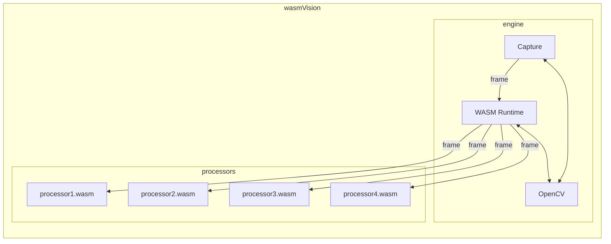

[](https://github.com/wasmvision/wasmvision/actions/workflows/linux.yml) [](https://github.com/wasmvision/wasmvision/actions/workflows/macos.yml) [](https://github.com/wasmvision/wasmvision/actions/workflows/windows.yml) [](https://github.com/wasmvision/wasmvision/actions/workflows/docker.yml)

wasmVision gets you up and running with computer vision.

It provides a high-performance computer vision processing engine that is designed to be customized and extended using WebAssembly.

## Quick start

- [Linux](#linux)
- [macOS](#macos)
- [Windows](#windows)
- [Docker](#docker)

### Linux

You can download the latest release for Linux by looking under [Releases](https://github.com/wasmvision/wasmvision/releases) then clicking on the latest release. 

Under the "Assets" click on the link for either "wasmvision-linux-amd64" or "wasmvision-linux-arm64" depending on your processor.

Extract the executable to your desired directory.

You might need to set the file as "executable", which you can do from the command line by running `chmod +x ./wasmvision` in the same directory to which you extracted the `wasmvision` executable.

Verify wasmVision is installed by running these commands:

```shell
cd /path/to/wasmvision/install
wasmvision version
```

You can obtain the latest released processors by downloading the "wasmvision-processors" file under "Assets" for the same release.

Extract the files to either the same directory you used for the `wasmvision` executable or a subdirectory in that directory.

Now you can run a test to capture video using your webcam, blur it using a WebAssembly processor, and then stream the output to port 8080 on your local machine:

```shell
wasmvision run -p /path/to/processors/blur.wasm -mjpeg=true
```

Point your browser to `http://localhost:8080` and you can see the output.


### macOS

You can install wasmVision on macOS using Homebrew:

```shell
brew tap wasmvision/tools
brew install wasmvision
```

Verify it is installed like this:

```shell
wasmvision version
```

You can obtain the latest released processors by downloading the "wasmvision-processors" file under "Assets" for the same release.

Extract the files to either the same directory you used for the `wasmvision` executable or a subdirectory in that directory.

Now you can run a test to capture video using your webcam, blur it using a WebAssembly processor, and then stream the output to port 8080 on your local machine:

```shell
wasmvision run -p /path/to/processors/blur.wasm -mjpeg=true
```

Point your browser to `http://localhost:8080` and you can see the output.

### Windows

You can download the latest release for Windows by looking under [Releases](https://github.com/wasmvision/wasmvision/releases) then clicking on the latest release. 

Under the "Assets" click on the link for "wasmvision-windows-amd64".

NOTE: you will likely need to configure your Windows Defender to download the ZIP file with the `wasmvision.exe` executable.

Extract the executable to your desired directory.

Verify it is installed like this:

```shell
chdir C:\path\to\wasmvision\install
wasmvision.exe version
```

You can obtain the latest released processors by downloading the "wasmvision-processors" file under "Assets" for the same release.

Extract the files to either the same directory you used for the `wasmvision` executable or a subdirectory in that directory.

Now you can run a test to capture video using your webcam, blur it using a WebAssembly processor, and then stream the output to port 8080 on your local machine:

```shell
wasmvision.exe run -p C:\path\to\processors\blur.wasm -mjpeg=true
```

You will probably need to configure Windows Firewall to allow the `wasmvision.exe` executable to access the network port on your local machine.

Point your browser to `http://localhost:8080` and you can see the output.

### Docker

You can run wasmVision using Docker.

Pull the current development version:

```shell
docker pull ghcr.io/wasmvision/wasmvision
```

Verify it is installed like this:

```shell
docker run ghcr.io/wasmvision/wasmvision version
```

Now you can run a test to capture video using your webcam, blur it using a WebAssembly processor, and then stream the output to port 8080 on your local machine:

```shell
docker run --privileged --network=host ghcr.io/wasmvision/wasmvision run -p /processors/blur.wasm -mjpeg=true
```

Point your browser to `http://localhost:8080` and you can see the output.

## Development

For information on how to obtain development builds, or work on development for wasmVision itself, please see [DEVELOPMENT.md](./DEVELOPMENT.md)

## How it works



The wasmVision engine is written in the [Go programming language](https://go.dev/) using the [GoCV Go language wrappers](https://github.com/hybridgroup/gocv) for [OpenCV](https://github.com/opencv/opencv) and the [Wazero WASM runtime](https://github.com/tetratelabs/wazero).

wasmVision processing modules are WebAssembly guest modules that support the [wasmCV interface](https://github.com/wasmvision/wasmcv).

See the [processors directory](./processors/) for some already compiled processors you can try out.

These processing modules can be written in Go, Rust, or the C programming language.

The pipeline of Processor modules are called in order, one after another. The output from the first is passed into the second, and so on. Once the last processor module has finished, the frame resources are cleaned up. Then the next frame is read from the capture device and passed into the first processor module.

See the [ARCHITECTURE.md](ARCHITECTURE.md) document for more details.


