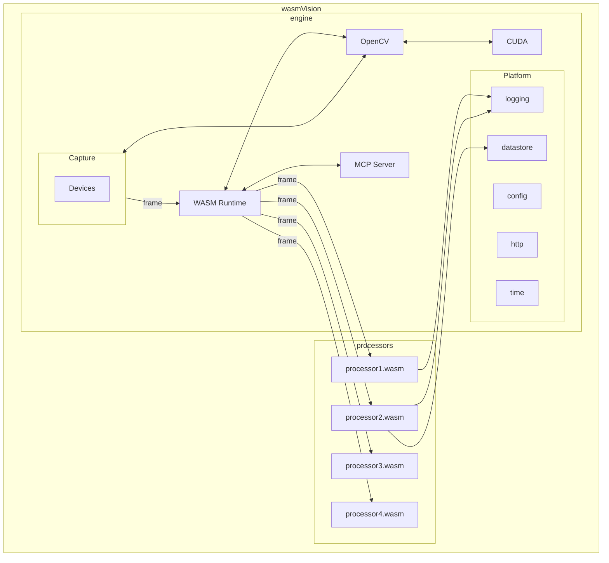

# Architecture

## Overview

The pipeline of Processor modules are called in order, one after another. The output from the first is passed into the second, and so on. Once the last processor module has finished, the frame resources are cleaned up. Then the next frame is read from the capture device and passed into the first processor module.

### Engine

The wasmVision engine. Includes platform capabilities such as MJPEG streaming and saving to files.

### Capture

This is how wasmVision can capture or import images or video to be processed from a connected webcam, from files, or from streams.

### Devices

Specific hardware or software devices that capture images or video. Currently supported devices are a connected camera, a file input, or a stream input using GStreamer.

### Runtime

The wasmVision runtime consists of the WebAssembly runtime engine (currently Wazero) and the wasmVision host platform API functions such as logging, configuration, and making http calls to external servers.

### Processors

The image processing modules that are used by wasmVision. These are modules written using Go, Rust, or C, and compiled into WebAssembly. They use the [wasmCV interface](https://github.com/wasmvision/wasmcv) and the [wasmVision platform interface](https://github.com/wasmvision/wasmvision-sdk). See [processors directory](../processors/) for several processors you can use, or use as examples.

### OpenCV

The computer vision processing capabilities implemented using OpenCV/GoCV. Take a look at the [`cv` directory](../cv/) for the code for this integration.

### Platform

The wasmVision platform capabilities provide essential services for processing modules.

- **Logging**: logging system to track events, errors, and other significant activities within wasmVision processors.
- **Configuration**: a way to pass configuration info into processors at runtime.
- **HTTP**: Utilities for making HTTP requests to external servers, enabling communication and data exchange with other services.
- **Datastore**: A simple key-value store for saving and retrieving data associated either with specific image frames, or else with specific processors.
- **Time**: utilities for processors to fetch the current host time.

### MCP Server

wasmVision includes experimental support for the [Model Context Protocol (MCP)](https://modelcontextprotocol.info/) by providing a [(MCP) Server](https://modelcontextprotocol.info/specification/draft/server/). See [MCP](./mcp.md) for more information.

### CUDA

wasmVision includes experimental support for GPU acceleration using [CUDA](https://en.wikipedia.org/wiki/CUDA).

For more information, see [using wasmVision with CUDA](./cuda.md)
