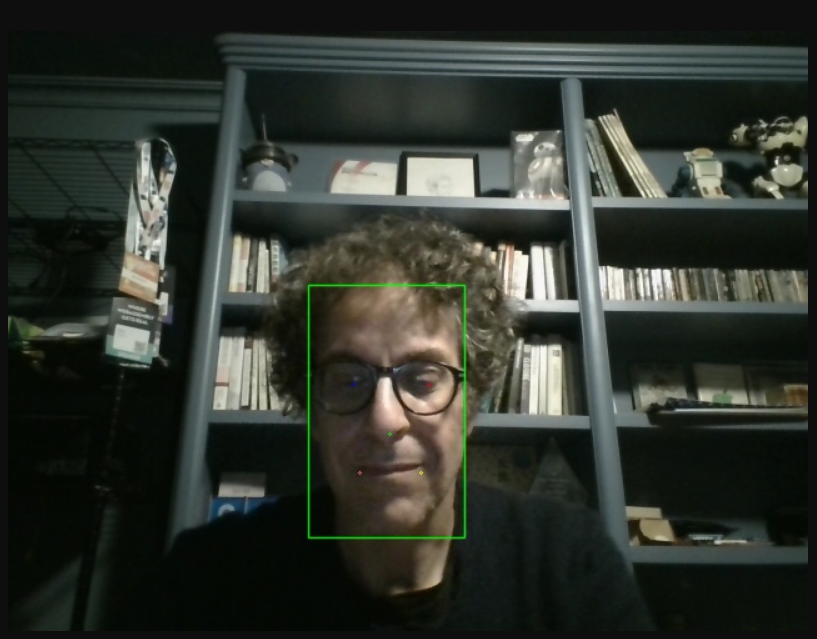
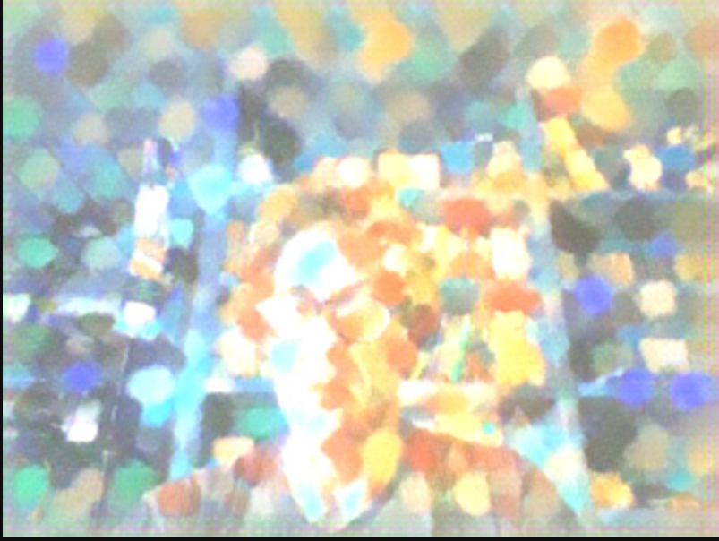

# Processors

This directory contains some examples of wasmVision guest processor modules. They have already been compiled so you can use the WASM files in this directory, or compile them individually from the source code.

## asciify.wasm

Processor written in Go that converts image frames to ascii art.

## blur.wasm

Processor written in Go that performs a blur on image frames.

## blurc.wasm

Processor written in C that performs a blur on the image frame.

## blurrs.wasm

Processor written in Rust that performs a blur on the image frame.

## candy.wasm

Processor written in Go that performs fast neural style transfer.

## gaussianblur.wasm

Processor written in Go that performs a gaussian blur on the image frame.

## faceblur.wasm

Processor that detects and then blurs faces using YuNet, a light-weight, fast and accurate face detection model.

## facedetectyn.wasm

Processor written using TinyGo that recognizes faces using YuNet, a light-weight, fast and accurate face detection model.

## facedetectynrs.wasm

Processor written using Rust that recognizes faces using YuNet, a light-weight, fast and accurate face detection model.

## hello.wasm

Processor written in Go that displays some information about the image frame.

## mosaic.wasm

Processor written in Go that performs fast neural style transfer.

## ollama.wasm

Processor that obtains text descriptions of image frames, by sending frames to an [Ollama](https://ollama.com/) server running a model for generating image descriptions such as `llava`.

## pointilism.wasm

Processor written in Go that performs fast neural style transfer.

## rainprincess.wasm

Processor written in Go that performs fast neural style transfer.

## udnie.wasm

Processor written in Go that performs fast neural style transfer.
