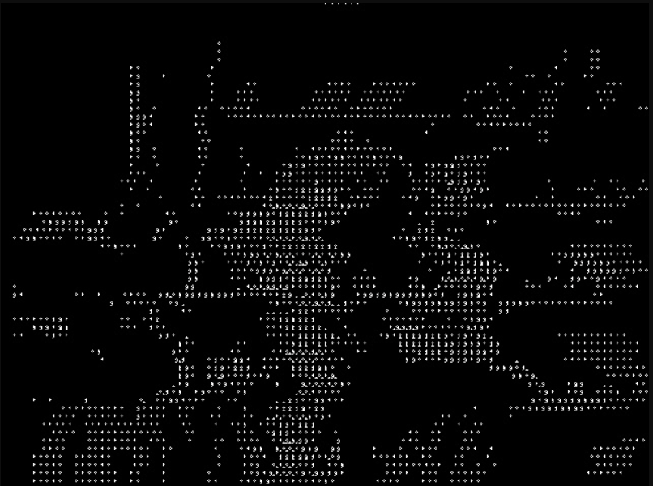
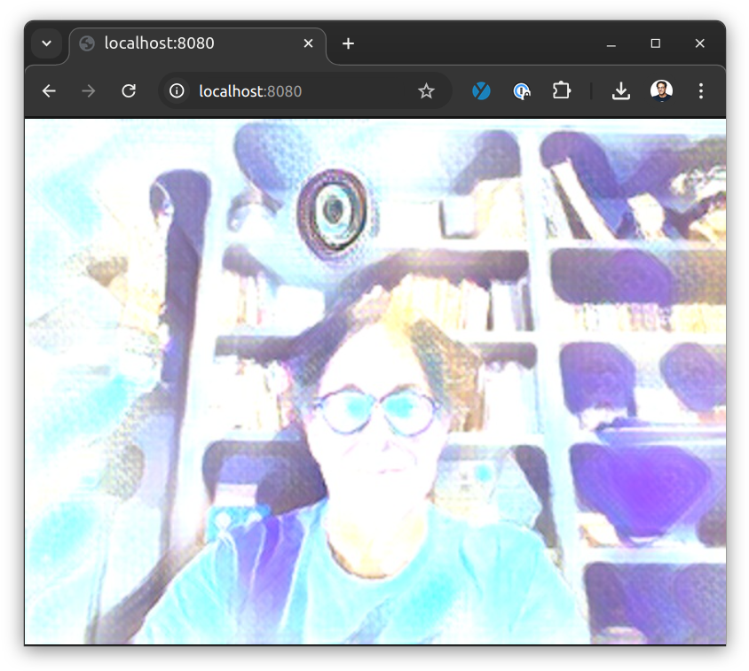
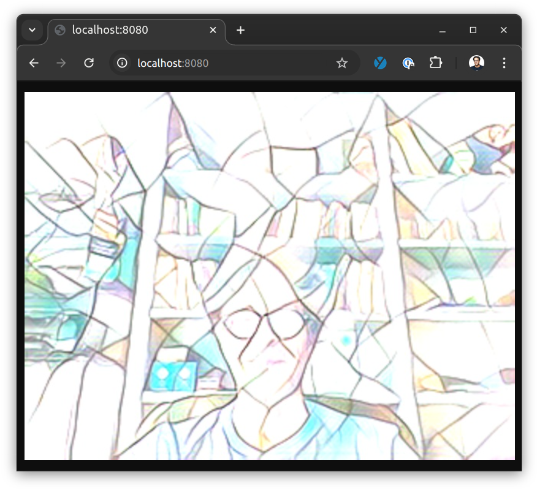

# Processors

This directory contains some examples of wasmVision guest processor modules. They have already been compiled so you can use the WASM files in this directory, or compile them individually from the source code.

## asciify.wasm

Processor written in Go that converts image frames to ascii art.

## blur.wasm

Processor written in Go that performs a blur on image frames.

## blurrs.wasm

Processor written in Rust that performs a blur on the image frame.

## candy.wasm

Processor written in Go that performs fast neural style transfer.

## gaussianblur.wasm

Processor written in Go that performs a  gaussian blur on the image frame.

## hello.wasm

Processor written in Go that displays some information about the image frame.

## mosaic.wasm

Processor written in Go that performs fast neural style transfer.
