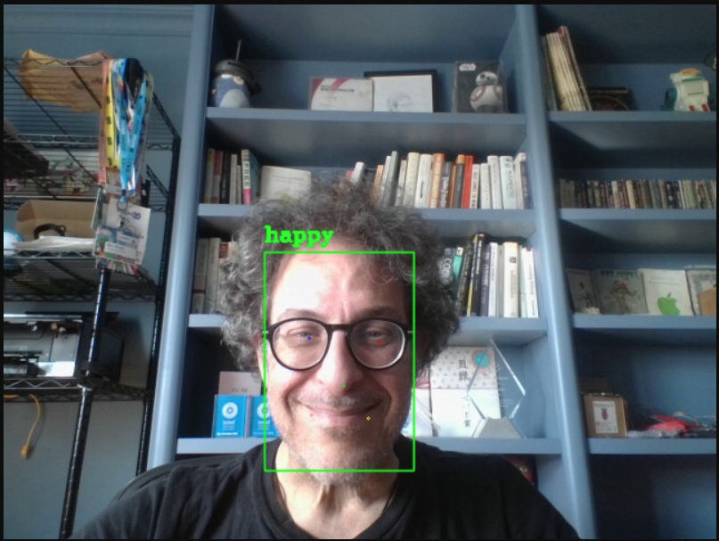
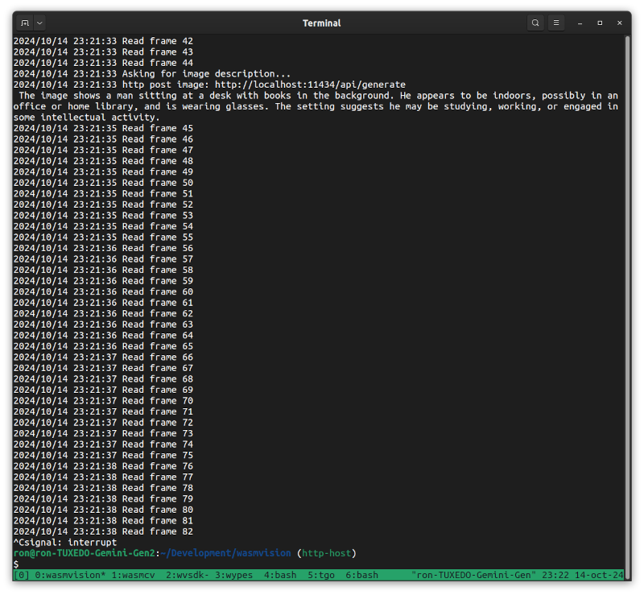

# Processors

This directory contains some examples of wasmVision guest processor modules. They have already been compiled so you can use the WASM files in this directory, or compile them individually from the source code.

## asciify.wasm

Processor written in Go that converts image frames to ascii art.

## blur.wasm

Processor written in Go that performs a blur on image frames.

## blurc.wasm

Processor written in C that performs a blur on the image frame.

## blurrs.wasm

Processor written in Rust that performs a blur on the image frame.

## captions.wasm

Processor written in Go that adds text captions to the final output image.

## face-expression.wasm

wasmVision processor using Facial Expression Recognition (FER) featuring semi-supervised learning model with 88.27% accuracy.

## faceblur.wasm

wasmVision processor that blurs previously detected faces before outputting the final image. 

## facedetectyn.wasm

Processor written using TinyGo that recognizes faces using YuNet, a light-weight, fast and accurate face detection model.

## facedetectynrs.wasm

Processor written using Rust that recognizes faces using YuNet, a light-weight, fast and accurate face detection model.

## gaussianblur.wasm

Processor written in Go that performs a gaussian blur on the image frame.

## hello.wasm

Processor written in Go that displays some information about the image frame.

## object-detector.wasm

wasmVision processor that performs object detection using the YOLOv8 real-time object detection model.

## ollama.wasm

Processor that obtains text descriptions of image frames, by sending frames to an [Ollama](https://ollama.com/) server running a model for generating image descriptions such as `llava`.

## style-transfer.wasm

Processor written in Go that performs fast neural style transfer using one of several different DNN models.
