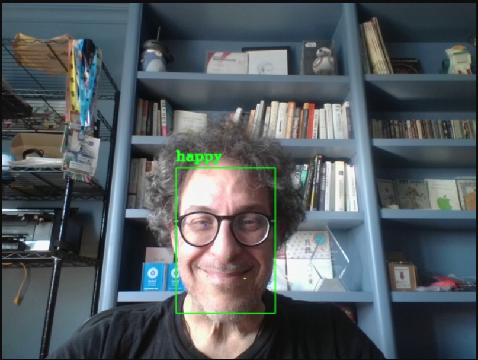

# face-expression



wasmVision processor using Facial Expression Recognition (FER) featuring semi-supervised learning model with 88.27% accuracy.

Face detection is first done using the `facedetectyn.wasm` processor, saving the detected face data to the wasmVision data store for each frame.

After that, this processor `face-expression.wasm` acts on any faces found for each frame, and uses its own model to try to detect the emotion based on the facial expression.

## How to build

```shell
tinygo build -o ../face-expression.wasm -target=wasip1 -buildmode=c-shared -scheduler=none --no-debug .
```

## How to run

```shell
wasmvision run -p facedetectyn.wasm -p face-expression.wasm -c detect-draw-faces=false
```

## Downloading the model

The first time you run the processor it will automatically download the model, or you can download it by running the command:

```shell
wasmvision download mobilefacenet_2022july
```

For more information see https://github.com/opencv/opencv_zoo/blob/main/models/facial_expression_recognition/README.md
