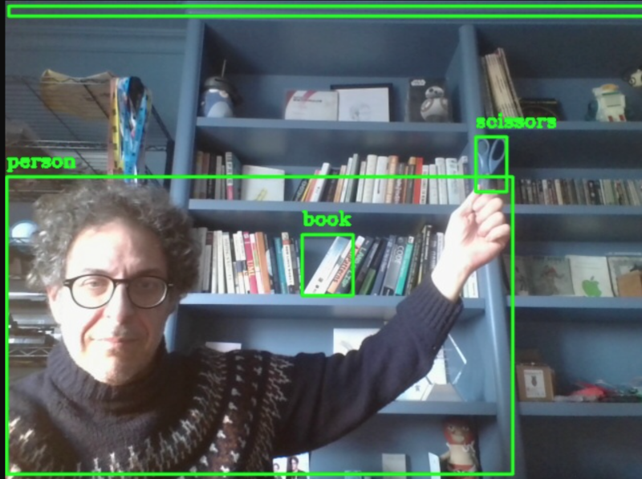

# object-detector



wasmVision processor that performs objects using YOLOv8.

## How to build

```shell
tinygo build -o ../object-detector.wasm -target=wasm-unknown .
```

## Downloading the model

The first time you run the processor it will automatically download the model, or you can download it by running the command:

```shell
wasmvision download yolov8n
```

For more information see:
