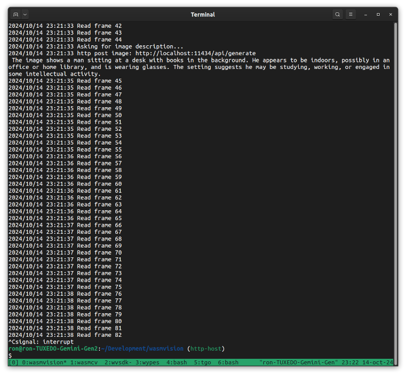

# ollama



wasmVision processor that obtains text descriptions of image frames, by sending frames to an [Ollama](https://ollama.com/) server running a model for generating image descriptions such as `llava`.

LLaVA is a multimodal model that combines a vision encoder and Vicuna for general-purpose visual and language understanding, achieving impressive chat capabilities mimicking spirits of the multimodal GPT-4.

## How to build

```shell
tinygo build -o ../ollama.wasm -target=wasip1 -buildmode=c-shared .
```

## Running Ollama

In order to run this processor, you need to first run the Ollama server with a model that supports image descriptions such as `llava`.

For example:

```shell
docker run --gpus=all -d -v ${HOME}/.ollama:/root/.ollama -v ${HOME}/ollama-import:/root/ollama-import -p 11434:11434 --name ollama ollama/ollama:latest
docker exec ollama ollama llava
```

For more information see https://ollama.com/library/llava:13b

### Ollama vision models


You can use the `-c model=<name>` flag to specify which model the processor should use. The default is `llava`.

This command runs the `ollama.wasm` processor using the `bakllava` model:

```shell
wasmvision run -p ollama -c model=bakllava
```

Ollama vision models that have been verified to work with wasmVision are:

#### `bakllava`

BakLLaVA is a multimodal model consisting of the Mistral 7B base model augmented with the LLaVA architecture.

https://ollama.com/library/bakllava


#### `llava`

LLaVA is a novel end-to-end trained large multimodal model that combines a vision encoder and Vicuna for general-purpose visual and language understanding.

https://ollama.com/library/llava


#### `moondream`

moondream2 is a small vision language model designed to run efficiently on edge devices.

https://ollama.com/library/moondream
