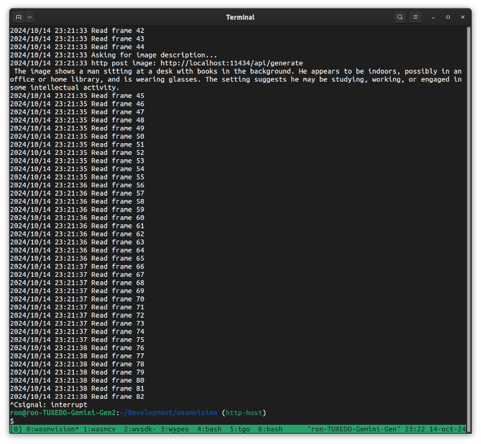

# ollama



wasmVision processor that obtains text descriptions of image frames, by sending frames to an [Ollama](https://ollama.com/) server running a model for generating image descriptions such as `llava`.

LLaVA is a multimodal model that combines a vision encoder and Vicuna for general-purpose visual and language understanding, achieving impressive chat capabilities mimicking spirits of the multimodal GPT-4.

## How to build

```shell
tinygo build -o ../ollama.wasm -target=wasip1 -buildmode=c-shared -scheduler=none --no-debug .
```

## Running Ollama

In order to run this processor, you need to first run the Ollama server with a model that supports image descriptions such as `llava`.

For example:

```shell
docker run --gpus=all -d -v ${HOME}/.ollama:/root/.ollama -v ${HOME}/ollama-import:/root/ollama-import -p 11434:11434 --name ollama ollama/ollama:latest
docker exec ollama ollama llava
```

For more information see https://ollama.com/library/llava:13b

## Running wasmVision

You can use the `-c ollama-model=<name>` flag to specify which model the processor should use. The default is `llava`.

This command runs the `ollama.wasm` processor using the `bakllava` model:

```shell
wasmvision run -p ollama -c ollama-model=bakllava
```

## Configuration

The following configuration settings are available for the `ollama.wasm` processor.

### `ollama-url`

Set the URL of the Ollama server to call like this:

```shell
-c ollama-url="http://localhost:11111"
```

Default value: "http://localhost:11434"

### `ollama-prompt`

Set the prompt for Ollama like this:

```shell
-c ollama-prompt="What is in this image?"
```

Default value: "Describe what is in this picture in highly complimentary terms using 6 words or less."

### `ollama-model`

Set the vision model for Ollama to use like this:

```shell
-c ollama-model=bakllava
```

Default value: "llava"

For more information about Ollama vision models, see the next section.

## Vision Language Models

Vision Language Models (VLMs) that have been verified to work with wasmVision are:

#### `bakllava`

BakLLaVA is a multimodal model consisting of the Mistral 7B base model augmented with the LLaVA architecture.

https://ollama.com/library/bakllava


#### `gemma3`

Gemma is a lightweight, family of models from Google built on Gemini technology. The Gemma 3 models are multimodal—processing text and images—and feature a 128K context window with support for over 140 languages. Available in 1B, 4B, 12B, and 27B parameter sizes, they excel in tasks like question answering, summarization, and reasoning, while their compact design allows deployment on resource-limited devices.

https://ollama.com/library/gemma3


#### `granite3.2-vision`

A compact and efficient vision-language model, specifically designed for visual document understanding, enabling automated content extraction from tables, charts, infographics, plots, diagrams, and more.

https://ollama.com/library/granite3.2-vision
https://huggingface.co/ibm-granite/granite-vision-3.2-2b


#### `llama3.2-vision`

Llama 3.2 Vision is a collection of instruction-tuned image reasoning generative models in 11B and 90B sizes.

**NOTE** not available in the EU

https://ollama.com/library/llama3.2-vision


#### `llava`

LLaVA is a novel end-to-end trained large multimodal model that combines a vision encoder and Vicuna for general-purpose visual and language understanding.

https://ollama.com/library/llava


#### `llava-phi3`

LLaVA model fine-tuned from Phi 3 Mini 4k, with strong performance benchmarks on par with the original LLaVA model.

https://ollama.com/library/llava-phi3
https://huggingface.co/xtuner/llava-phi-3-mini-gguf


#### `minicpm-v`

MiniCPM-V 2.6 is the latest and most capable model in the MiniCPM-V series. The model is built on SigLip-400M and Qwen2-7B with a total of 8B parameters. It exhibits a significant performance improvement over MiniCPM-Llama3-V 2.5, and introduces new features for multi-image and video understanding.

https://ollama.com/library/minicpm-v
https://huggingface.co/openbmb/MiniCPM-V-2_6


#### `moondream`

moondream2 is a small vision language model designed to run efficiently on edge devices.

https://ollama.com/library/moondream


#### `nanollava`

nanoLLaVA is a "small but mighty" 1B vision-language model designed to run efficiently on edge devices.

https://ollama.com/qnguyen3/nanollava
https://huggingface.co/qnguyen3/nanoLLaVA
