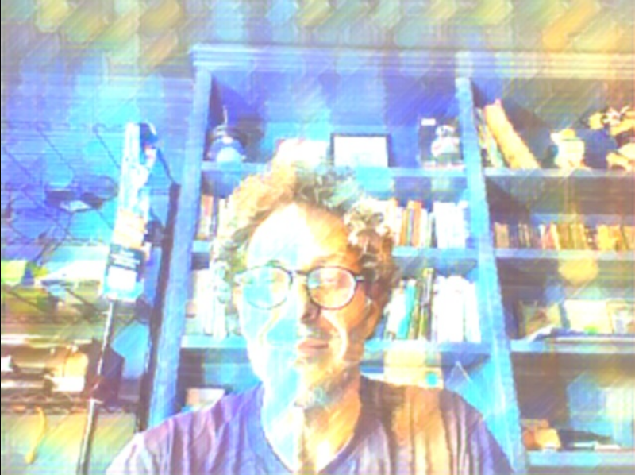

# rain princess



wasmVision processor that renders images using fast neural style transfer.

## How to build

```shell
tinygo build -o ../rainprincess.wasm -target=wasm-unknown --no-debug .
```

## Downloading the model

The first time you run the processor it will automatically download the model, or you can download it by running the command:

```shell
wasmvision download rain-princess-9
```

For more information see https://github.com/onnx/models/blob/main/validated/vision/style_transfer/fast_neural_style/README.md
